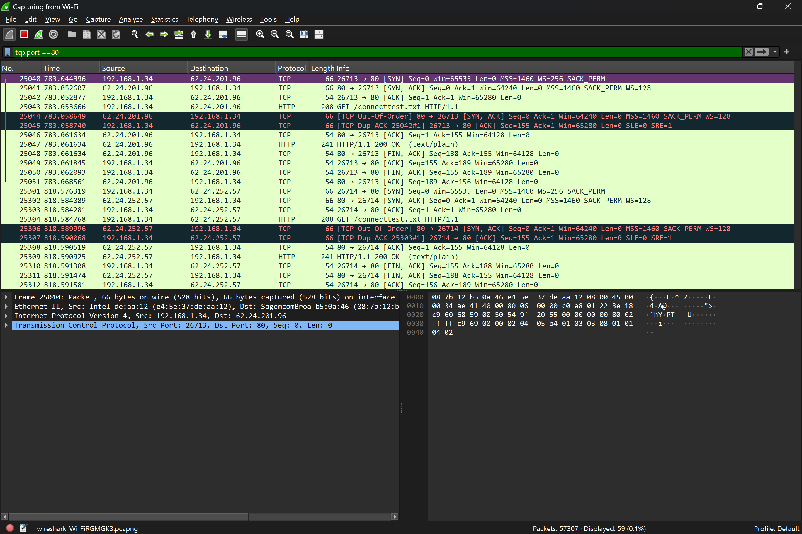
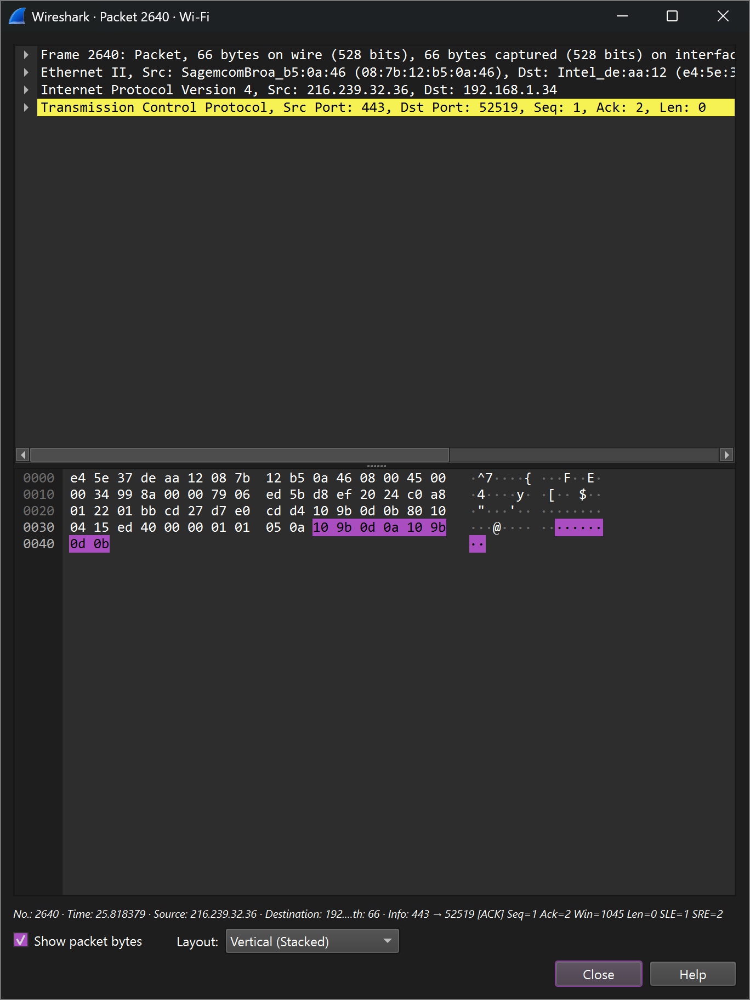
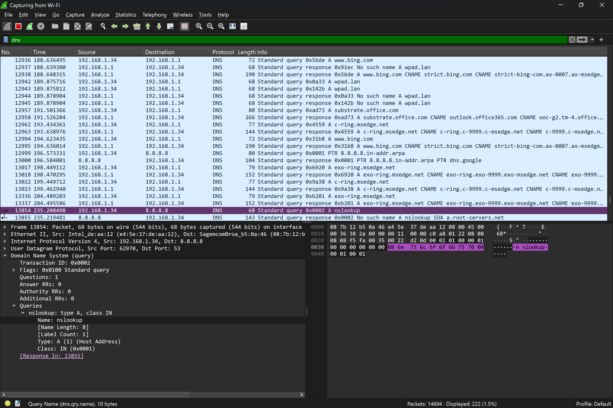
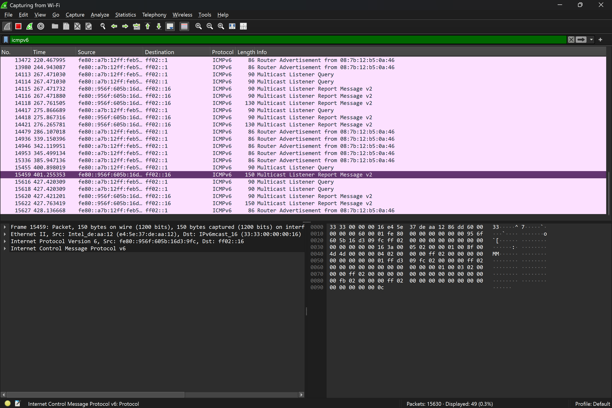

Wireshark Network Traffic Analysis & Protocol Investigation
* **Goal:** Capture and analyze live network traffic to validate the TCP/IP stack and modern security protocols.
* **Skills:** Packet analysis, display filters, OSI Model mapping, and protocol identification (TCP, DNS, ICMPv6).
* **Key Achievement:** Successfully isolated a TCP 3-way handshake on Port 80 and analyzed IPv6 Neighbor Discovery mechanisms to troubleshoot local-link connectivity.

---

#### 🧠 Skills Practiced
* **Packet Capturing & Saving:** Managed live traffic captures and exported specific packets for offline analysis.
* **Advanced Filtering:** Applied display filters (e.g., `tcp.port == 80`, `icmpv6`) to isolate specific protocol conversations.
* **Protocol Analysis:** Evaluated the behavior of ICMP, DNS, and TCP handshakes to verify network health.
* **Technical Documentation:** Systematically documented network findings with high-fidelity screenshots for reporting.
* **Real-World Troubleshooting:** Practiced identifying HTTP traffic within modern, forced HTTPS-only environments.

---

#### 📸 Lab Evidence: Network Analysis Walkthrough

#### A. TCP Port 80 Handshake (Layer 4)
> **Observation:** Captured the SYN → SYN-ACK → ACK sequence during a connection setup. Unlike many modern HTTPS-encrypted sessions, I successfully isolated a clear-text HTTP/1.1 GET request to `connecttest.txt`.

---

#### B. Deep Packet Inspection (TCP Header)
> **Observation:** Analyzed the Transmission Control Protocol header to verify Source/Destination ports and Sequence numbering, confirming a reliable transport layer connection.

---

#### C. DNS Resolution (UDP Port 53)
> **Observation:** Monitored the name resolution lifecycle using `nslookup`. The capture shows the Standard Query sent to the DNS server and the corresponding IP address response.

---

#### D. IPv6 Neighbor Discovery (ICMPv6)
> **Observation:** Captured ICMPv6 Neighbor Solicitation and Advertisement messages. This demonstrates an understanding of how IPv6 manages local link-layer discovery without using ARP.

---

#### 🛡 Notes on Modern Protocol Behavior
While most web traffic is now encrypted via TLS/HTTPS (Port 443), this lab successfully targeted Port 80 to observe raw protocol headers. This demonstrates an understanding of the differences between secure and unencrypted traffic essential for network troubleshooting and security analysis.
